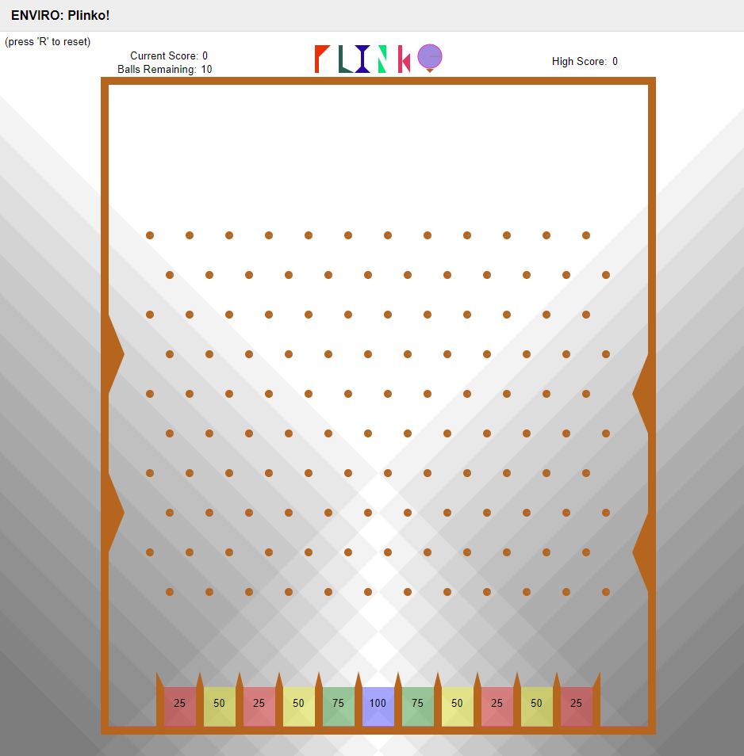

# Plinko520

## Overview

This game was developed as a final project for UW's EEP520 Software for Embedded Systems course, utilizing Elma and Enviro. 

A modified version of Plinko was implemented, allowing the user 10 chances to score a maximum of 1000 points.

***Future modifications may include bonus chances given a streak of 100 point scores to further increase the highscore!***




## Installation/Setup

To begin, install docker using a method most suitable for your supported platform here:
https://docs.docker.com/install/

Using a command line, navigate to a suitable location to contain this program and run the following command:
```
> git clone https://github.com/josefborrayo/Plinko520
```


This project utilizes version 1.6 of enviro, more info here: https://github.com/klavinslab/enviro

Run one of the following suitable for your platform:

**MAC**
```
> docker run -v $PWD/clonelocation:/source -it klavins/520w20:cpp bash
```

**WINDOWS**
```
> docker run -p80:80 -p8765:8765 -v /c/Users/username/clonelocation:/source -it klavins/enviro:v1.6 bash
```
***Note: For Linux users please refer to enviro documentation***

After initializing your docker instance run the following two commands
```
> esm start
> enviro
```

### Navigate to localhost in your browser to see the game ready to play!
